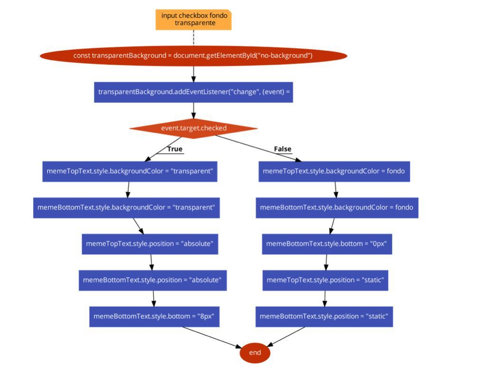

# generador-de-memes

Segundo TP - ADA Frontend (Primer trabajo con JavaScript)

---

## _Built with_

- _HTML_
- _CSS_
- _JS_
- _Frameworks (Bootstrap y Materialize)_

---

## _Diagrama de Flujos_

Ejemplo de Diagrama de Flujos para la función del ckeckbox que elimima el color de fondo de los textos del meme.

## 

## _Future Updates_

_A medida que vaya avanzando en el curso, voy a ir subiendo nuevos proyectos y trabajos prácticos... Stay Tuned :wink:!_

---

## _Contact_

:speech_balloon: [Email](mailto:lorepetriella@gmail.com?subject=Contact "Hi!")

---

## _Profile_

:octocat: [My Profile](https://github.com/LorePetriella "Lore Petriella")

---

**_:bulb: By Lore Petriella_**

